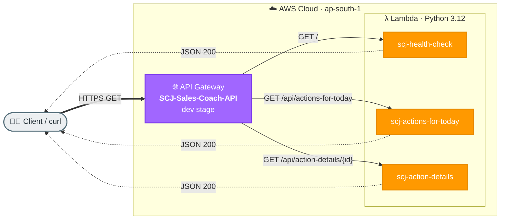

# Task 1: REST API with API Gateway and Lambda

## Goal
Create REST API endpoints using Amazon API Gateway and AWS Lambda. This task demonstrates how a client request reaches API Gateway, invokes Lambda, and receives a JSON response.

## Architecture


## Resources Created
| Service | Resource | Purpose |
|---|---|---|
| API Gateway | SCJ-Sales-Coach-API | Regional REST API front door |
| Lambda | scj-health-check | Health check endpoint |
| Lambda | scj-actions-for-today | Returns action recommendations |
| Lambda | scj-action-details | Returns action detail by ID |

## Base URL
```text
https://kboq3nibic.execute-api.ap-south-1.amazonaws.com/dev
```

## Endpoints
| Method | Path | Description |
|---|---|---|
| GET | / | Health check |
| GET | /api/actions-for-today | List actions for today |
| GET | /api/action-details/{id} | Get details for one action |

## Step-by-Step Setup
1. Create Lambda function `scj-health-check` with Python 3.12 runtime.
2. Create REST API `SCJ-Sales-Coach-API` in API Gateway.
3. Create root GET method and integrate it with the health Lambda using Lambda proxy integration.
4. Deploy the API to the `dev` stage.
5. Create additional Lambda functions for action list and action details.
6. Add API resources `/api/actions-for-today` and `/api/action-details/{id}`.
7. Add GET methods and connect each method to its Lambda function.
8. Deploy the updated API again to the `dev` stage.
9. Test all endpoints using curl.

## How to Run / Demo
```bash
curl -s https://kboq3nibic.execute-api.ap-south-1.amazonaws.com/dev/

curl -s https://kboq3nibic.execute-api.ap-south-1.amazonaws.com/dev/api/actions-for-today

curl -s https://kboq3nibic.execute-api.ap-south-1.amazonaws.com/dev/api/action-details/1
```

## What to Verify
- API Gateway returns HTTP 200.
- Lambda logs appear in CloudWatch Logs.
- Each route invokes the correct Lambda function.

## End-to-End Flow, Solution & Service Choices
1. Client sends an HTTP request to API Gateway.
2. API Gateway validates route/method and invokes Lambda.
3. Lambda runs business logic and returns a structured JSON payload.
4. API Gateway maps Lambda output to HTTP response and returns it to client.

### Why this solution
- This is the lightest serverless pattern for REST APIs: no server management, fast setup, and pay-per-request pricing.
- It cleanly separates API concerns (routing/auth/throttling) from compute concerns (business logic).

### Why these AWS services
- API Gateway: managed HTTP front door with routing, throttling, and easy Lambda integration.
- Lambda: event-driven compute that scales automatically and removes infrastructure operations.
- CloudWatch (implicit): native logs/metrics for API and function observability.
