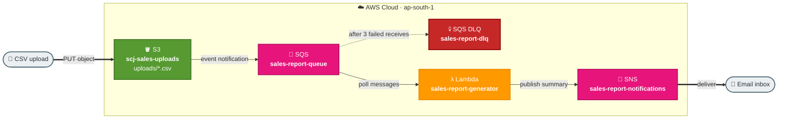

# Task 2: Event-Driven Flow with S3, SQS, Lambda, and SNS

## Goal
Build an event-driven pipeline where uploading a CSV file to S3 triggers report generation through SQS and Lambda, then sends a notification through SNS.

## Architecture

```

## Resources Created
| Service | Resource | Purpose |
|---|---|---|
| S3 | scj-sales-uploads | Receives CSV uploads under uploads/ |
| SQS | sales-report-queue | Main event queue |
| SQS | sales-report-dlq | Dead letter queue |
| Lambda | sales-report-generator | Reads CSV and generates summary |
| SNS | sales-report-notifications | Sends email notification |

## Important Values
```text
Queue URL: https://sqs.ap-south-1.amazonaws.com/353211646521/sales-report-queue
Email subscription: abhirvce@gmail.com
Lambda env var: SNS_TOPIC_ARN
```

## Step-by-Step Setup
1. Create S3 bucket `scj-sales-uploads`.
2. Create folder prefix `uploads/` for incoming CSV files.
3. Create SQS queue `sales-report-queue` with visibility timeout around 150 seconds.
4. Create DLQ `sales-report-dlq` and configure redrive policy with max receives = 3.
5. Add SQS access policy allowing S3 to send messages to the queue.
6. Create SNS topic `sales-report-notifications`.
7. Subscribe email address and confirm the subscription email.
8. Create Lambda `sales-report-generator` with required libraries/layer.
9. Add SQS trigger to Lambda.
10. Configure S3 event notification for `uploads/*.csv` to SQS.
11. Upload a CSV and validate the processing output.

## How to Run / Demo
```bash
aws s3 cp sales_data.csv s3://scj-sales-uploads/uploads/sales_data.csv --no-verify-ssl

aws sqs get-queue-attributes   --queue-url https://sqs.ap-south-1.amazonaws.com/353211646521/sales-report-queue   --attribute-names ApproximateNumberOfMessages   --no-verify-ssl
```

## What to Verify
- Queue message count returns to 0 after processing.
- CloudWatch Logs for `/aws/lambda/sales-report-generator` show file processing.
- Email report is received through SNS.
- DLQ remains empty for successful runs.

## End-to-End Flow, Solution & Service Choices
1. User uploads a CSV file to S3.
2. S3 event publishes work to SQS.
3. Lambda consumes queue messages and processes report logic.
4. Lambda publishes completion status to SNS for notifications.

### Why this solution
- Event-driven decoupling absorbs traffic spikes and protects downstream processing.
- Queue-based buffering improves reliability and retry handling for file-processing workloads.

### Why these AWS services
- S3: durable, low-cost storage and native event source for object-based workflows.
- SQS: reliable message buffering, retries, and dead-letter support.
- Lambda: stateless processing per message with automatic scale.
- SNS: fan-out notifications to email or downstream subscribers.
