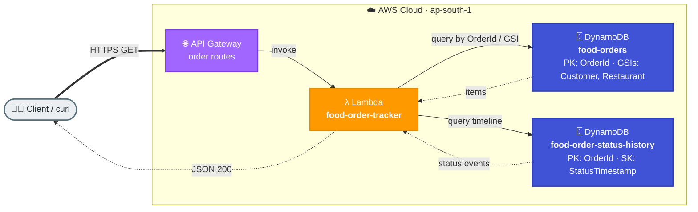

# Task 3: DynamoDB Table Design Based on Access Patterns

## Goal
Design and test a well-modeled DynamoDB schema for a food order tracking workflow, using explicit, business-meaningful key names (not generic `PK`/`SK`). This task focuses on access-pattern-first design.

## Architecture


## Resources Created
| Service | Resource | Purpose |
|---|---|---|
| DynamoDB | food-orders | One item per order; keyed by `OrderId` with GSIs for customer and restaurant lookups |
| DynamoDB | food-order-status-history | Order status timeline; keyed by `OrderId` + `StatusTimestamp` |
| Lambda | food-order-tracker | Query handler for each access pattern |
| API Gateway | Shared REST API | Exposes order endpoints |

## Base URL
```text
https://kboq3nibic.execute-api.ap-south-1.amazonaws.com/dev
```

## Key Design Principles
DynamoDB keys should describe the data they identify. Generic `PK`/`SK` names hide intent and make queries hard to read, so this design uses explicit, business-meaningful key names:

- **Partition key = the entity's natural identifier.** An order is identified by `OrderId`.
- **Sort key = the one-to-many relationship.** A status timeline is many events per order, ordered by `StatusTimestamp`.
- **Global Secondary Indexes (GSIs) serve alternate lookups** (by customer, by restaurant) without overloading the base table keys.

## Table Design

### Table 1 — `food-orders` (one item per order)
Primary key:
| Key | Attribute | Type | Example |
|---|---|---|---|
| Partition key | `OrderId` | String | `ORD-1001` |

Item attributes: `CustomerId`, `RestaurantId`, `OrderCreatedAt`, `CurrentStatus`, `TotalAmount`, `Items`.

Sample item:
| OrderId | CustomerId | RestaurantId | OrderCreatedAt | CurrentStatus | TotalAmount |
|---|---|---|---|---|---|
| ORD-1001 | C001 | R001 | 2026-06-10T14:30:00 | DELIVERED | 450 |

Global Secondary Indexes:
| Index | Partition key | Sort key | Serves |
|---|---|---|---|
| `CustomerOrdersIndex` | `CustomerId` | `OrderCreatedAt` | All orders for a customer, newest first |
| `RestaurantOrdersIndex` | `RestaurantId` | `OrderCreatedAt` | All orders for a restaurant, newest first |

### Table 2 — `food-order-status-history` (timeline events)
Primary key:
| Key | Attribute | Type | Example |
|---|---|---|---|
| Partition key | `OrderId` | String | `ORD-1001` |
| Sort key | `StatusTimestamp` | String (ISO 8601) | `2026-06-10T14:35:00` |

Item attributes: `Status`, `Note`.

Sample items:
| OrderId | StatusTimestamp | Status | Note |
|---|---|---|---|
| ORD-1001 | 2026-06-10T14:30:00 | PLACED | Order placed |
| ORD-1001 | 2026-06-10T14:35:00 | ACCEPTED | Restaurant accepted |
| ORD-1001 | 2026-06-10T14:50:00 | OUT_FOR_DELIVERY | Rider picked up the order |
| ORD-1001 | 2026-06-10T15:10:00 | DELIVERED | Delivered to customer |

## Access Patterns
| # | Access pattern | Table / Index | Key condition |
|---|---|---|---|
| 1 | Get all orders for a customer | `food-orders` → `CustomerOrdersIndex` | `CustomerId = C001` (sorted by `OrderCreatedAt`) |
| 2 | Track order status timeline | `food-order-status-history` | `OrderId = ORD-1001` (sorted by `StatusTimestamp`) |
| 3 | Get order details | `food-orders` (base table) | `GetItem(OrderId = ORD-1001)` |
| 4 | Restaurant dashboard | `food-orders` → `RestaurantOrdersIndex` | `RestaurantId = R001` (sorted by `OrderCreatedAt`) |

## Step-by-Step Setup
1. List all required query patterns before creating any table.
2. Create `food-orders` with partition key `OrderId`, plus `CustomerOrdersIndex` and `RestaurantOrdersIndex` GSIs.
3. Create `food-order-status-history` with partition key `OrderId` and sort key `StatusTimestamp`.
4. Insert sample orders and their status-timeline events.
5. Create Lambda logic that maps each API request to the matching table/index query.
6. Add API Gateway routes for customer history, order details, and tracking.
7. Test each access pattern with curl.

## Project Files
| File | Purpose |
|---|---|
| setup_dynamodb.py | Creates both tables (+ GSIs), seeds sample data, and demos every access pattern |
| requirements.txt | Python dependency (boto3) |

## Reproducible Setup (boto3)
Provision the exact design above (both tables, GSIs, and sample data) with the included script:

```bash
cd week1/task3-dynamodb-design
pip install -r requirements.txt

# set temporary AWS credentials in this shell first
export AWS_ACCESS_KEY_ID="..."
export AWS_SECRET_ACCESS_KEY="..."
export AWS_SESSION_TOKEN="..."
export AWS_REGION="ap-south-1"

python setup_dynamodb.py all       # create tables + seed data + run access-pattern demo
```

Individual commands:
```bash
python setup_dynamodb.py create    # create food-orders (+GSIs) and food-order-status-history
python setup_dynamodb.py seed      # insert sample orders and status events
python setup_dynamodb.py demo      # run all four access-pattern queries
python setup_dynamodb.py teardown  # delete both tables
```

## How to Run / Demo
```bash
curl -s "https://kboq3nibic.execute-api.ap-south-1.amazonaws.com/dev/orders?customerId=C001"

curl -s https://kboq3nibic.execute-api.ap-south-1.amazonaws.com/dev/orders/ORD-1001

curl -s https://kboq3nibic.execute-api.ap-south-1.amazonaws.com/dev/orders/ORD-1001/track

curl -s https://kboq3nibic.execute-api.ap-south-1.amazonaws.com/dev/orders/health
```

## What to Verify
- Customer order history returns all orders for `C001`, newest first, via `CustomerOrdersIndex`.
- Tracking endpoint returns the timeline sorted by `StatusTimestamp`.
- Order details come from a single `GetItem` on `food-orders` by `OrderId`.
- Restaurant dashboard lists orders for `R001` via `RestaurantOrdersIndex`.

## End-to-End Flow, Solution & Service Choices
1. Client submits order-tracking operations through API routes.
2. Lambda maps each request to the matching table or GSI query.
3. DynamoDB serves order lookups from `food-orders` (by `OrderId` or a GSI) and status timelines from `food-order-status-history` (by `OrderId` + `StatusTimestamp`).
4. API returns low-latency results for lookup, history, and status operations.

### Why this solution
- Access-pattern-first modeling with meaningful keys keeps queries self-documenting and predictable.
- Purpose-built keys (`OrderId`, `CustomerId`, `RestaurantId`, `StatusTimestamp`) plus GSIs avoid overloaded generic keys and make each access pattern explicit.

### Why these AWS services
- DynamoDB: single-digit millisecond reads/writes, seamless scaling, and GSIs for alternate access patterns.
- Lambda: thin compute layer to validate requests and choose the right table/index per query.
- API Gateway: consistent HTTP interface for application consumers.
