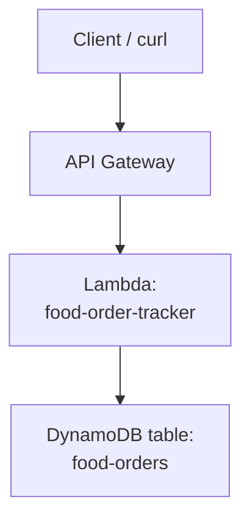

# Task 3: DynamoDB Table Design Based on Access Patterns

## Goal
Design and test a DynamoDB single-table pattern for a food order tracking workflow. This task focuses on access-pattern-first design.

## Architecture


## Resources Created
| Service | Resource | Purpose |
|---|---|---|
| DynamoDB | food-orders | Stores customers, orders, and order status timeline |
| Lambda | food-order-tracker | Query handler for access patterns |
| API Gateway | Shared REST API | Exposes order endpoints |

## Base URL
```text
https://kboq3nibic.execute-api.ap-south-1.amazonaws.com/dev
```

## Table Design
| PK | SK | Meaning |
|---|---|---|
| CUSTOMER#C001 | PROFILE | Customer profile |
| CUSTOMER#C001 | ORDER#2026-06-10T14:30 | Customer order reference |
| ORDER#ORD-1001 | META | Order details |
| ORDER#ORD-1001 | STATUS#2026-06-10T14:30:00 | Order placed |
| ORDER#ORD-1001 | STATUS#2026-06-10T14:35:00 | Restaurant accepted |
| ORDER#ORD-1001 | STATUS#2026-06-10T14:50:00 | Out for delivery |
| ORDER#ORD-1001 | STATUS#2026-06-10T15:10:00 | Delivered |
| RESTAURANT#R001 | ORDER#2026-06-10T14:30 | Restaurant order log |

## Access Patterns
1. Get all orders for a customer: `PK=CUSTOMER#C001`, `begins_with(SK, ORDER#)`.
2. Track order status timeline: `PK=ORDER#ORD-1001`, `begins_with(SK, STATUS#)`.
3. Get order details: `PK=ORDER#ORD-1001`, `SK=META`.
4. Restaurant dashboard: `PK=RESTAURANT#R001`, `begins_with(SK, ORDER#)`.

## Step-by-Step Setup
1. List all required query patterns before creating the table.
2. Choose generic partition key `PK` and sort key `SK`.
3. Insert sample customer, order, restaurant, and status records.
4. Create Lambda logic that translates API requests into DynamoDB queries.
5. Add API Gateway routes for customer history, order details, and tracking.
6. Test each access pattern with curl.

## How to Run / Demo
```bash
curl -s "https://kboq3nibic.execute-api.ap-south-1.amazonaws.com/dev/orders?customerId=C001"

curl -s https://kboq3nibic.execute-api.ap-south-1.amazonaws.com/dev/orders/ORD-1001

curl -s https://kboq3nibic.execute-api.ap-south-1.amazonaws.com/dev/orders/ORD-1001/track

curl -s https://kboq3nibic.execute-api.ap-south-1.amazonaws.com/dev/orders/health
```

## What to Verify
- Customer order history returns all orders for `C001`.
- Tracking endpoint returns a timeline sorted by status timestamp.
- Order metadata and timeline use the same table but different PK/SK patterns.
