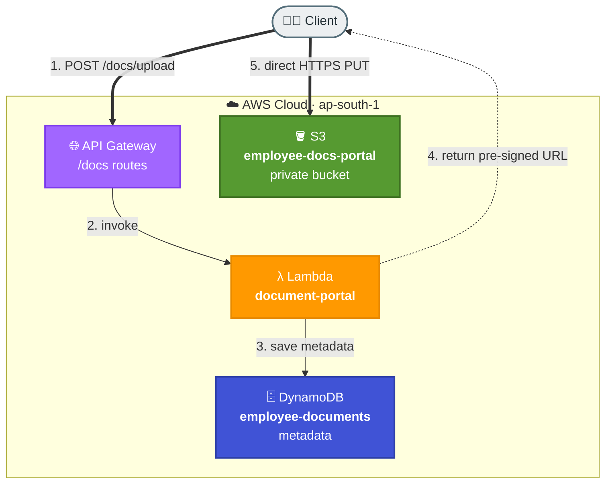

# Task 4: S3 Storage Integration with Pre-Signed URLs

## Goal
Integrate private S3 storage into an application workflow using pre-signed URLs. Users upload/download directly from S3 while metadata is tracked in DynamoDB.

## Architecture


## Resources Created
| Service | Resource | Purpose |
|---|---|---|
| S3 | employee-docs-portal | Private document storage |
| DynamoDB | employee-documents | Stores document metadata |
| Lambda | document-portal | Creates upload/download URLs and lists documents |
| API Gateway | Shared REST API | Exposes document endpoints |

## Base URL
```text
https://kboq3nibic.execute-api.ap-south-1.amazonaws.com/dev
```

## S3 Folder Pattern
```text
employee-docs-portal/
  E001/
    id_proof/aadhaar.pdf
    resume/resume_2026.pdf
  E002/
    id_proof/passport.pdf
```

## Endpoints
| Method | Path | Description |
|---|---|---|
| POST | /docs/upload | Generate pre-signed upload URL and save metadata |
| GET | /docs?employeeId=E001 | List employee documents |
| GET | /docs/download?employeeId=...&documentId=... | Generate pre-signed download URL |

## Step-by-Step Setup
1. Create private S3 bucket `employee-docs-portal`.
2. Create DynamoDB table `employee-documents` with employee/document keys.
3. Create Lambda `document-portal` with permission to generate S3 pre-signed URLs.
4. Add API Gateway route `POST /docs/upload`.
5. Add route `GET /docs` for listing metadata.
6. Add route `GET /docs/download` for download URLs.
7. Test by requesting an upload URL, uploading to S3, listing metadata, and requesting a download URL.

## How to Run / Demo
```bash
curl -s -X POST https://kboq3nibic.execute-api.ap-south-1.amazonaws.com/dev/docs/upload   -H "Content-Type: application/json"   -d '{"employeeId":"E001","docType":"id_proof","fileName":"aadhaar.pdf"}'

curl -X PUT "<pre-signed-upload-url>"   -H "Content-Type: application/pdf"   --data-binary @aadhaar.pdf

curl -s "https://kboq3nibic.execute-api.ap-south-1.amazonaws.com/dev/docs?employeeId=E001"

curl -s "https://kboq3nibic.execute-api.ap-south-1.amazonaws.com/dev/docs/download?employeeId=E001&documentId=<DOC_ID>"
```

## What to Verify
- S3 bucket remains private.
- Upload works only through the generated pre-signed URL.
- Metadata is stored in DynamoDB.
- Download URL is time-limited.

## End-to-End Flow, Solution & Service Choices
1. Client requests upload/download access through API.
2. Lambda verifies request and generates a pre-signed S3 URL.
3. Client transfers file directly with S3 using the signed URL.
4. Lambda stores/retrieves metadata in DynamoDB for indexing and tracking.

### Why this solution
- Pre-signed URL design removes large-file transfer load from Lambda/API and improves scalability.
- Short-lived signed access keeps private bucket security while enabling direct client transfer.

### Why these AWS services
- S3: scalable object storage optimized for file upload/download workflows.
- Lambda: secure URL generation and metadata orchestration.
- DynamoDB: fast metadata lookup by document/user keys.
- API Gateway: secure control plane endpoint for URL issuance.
