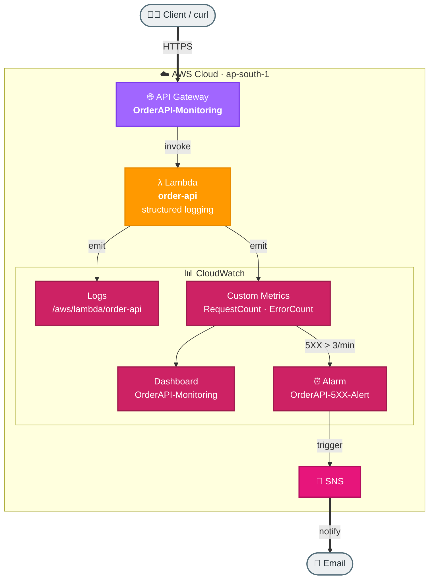

# Task 5: Request Logging and Basic Monitoring

## Goal
Add operational visibility to an API using structured Lambda logs, CloudWatch metrics, dashboard widgets, and alarms.

## Architecture


## Resources Created
| Service | Resource | Purpose |
|---|---|---|
| API Gateway | OrderAPI-Monitoring | REST API for monitored order endpoints |
| Lambda | order-api | Emits structured logs and metrics |
| CloudWatch Logs | /aws/lambda/order-api | Request and error logs |
| CloudWatch Alarm | OrderAPI-5XX-Alert | Alert when 5XX errors exceed threshold |
| CloudWatch Dashboard | OrderAPI-Monitoring | Visual monitoring dashboard |

## Base URL
```text
https://lfon6hkqoh.execute-api.ap-south-1.amazonaws.com/dev
```

## Metrics Captured
- RequestCount
- ErrorCount
- RequestLatency
- OrdersCreated

## Step-by-Step Setup
1. Create Lambda `order-api` with structured JSON logging.
2. Create API Gateway `OrderAPI-Monitoring`.
3. Add `/orders` and `/orders/health` routes.
4. Add custom metrics using CloudWatch metric APIs.
5. Create CloudWatch alarm `OrderAPI-5XX-Alert`.
6. Create SNS topic/subscription for alarm notification.
7. Create CloudWatch dashboard `OrderAPI-Monitoring`.
8. Generate successful and failed requests to validate logs, metrics, and alerts.

## How to Run / Demo
```bash
curl -s https://lfon6hkqoh.execute-api.ap-south-1.amazonaws.com/dev/orders/health

curl -s -X POST https://lfon6hkqoh.execute-api.ap-south-1.amazonaws.com/dev/orders   -H "Content-Type: application/json"   -d '{"customerId":"C001","items":[{"name":"Burger","qty":2,"price":250}]}'

curl -s -X POST https://lfon6hkqoh.execute-api.ap-south-1.amazonaws.com/dev/orders   -H "Content-Type: application/json"   -d "bad json"
```

## What to Verify
- Logs appear in `/aws/lambda/order-api`.
- Dashboard shows request count, errors, and latency.
- Repeated bad requests can trigger `OrderAPI-5XX-Alert`.

## End-to-End Flow, Solution & Service Choices
1. Client requests hit API Gateway and invoke Lambda.
2. Lambda emits structured application logs and custom metrics.
3. CloudWatch aggregates logs/metrics into dashboards.
4. CloudWatch alarms evaluate thresholds and trigger notifications/actions.

### Why this solution
- Operational visibility must be built into serverless APIs from day one to reduce mean time to detect and resolve issues.
- Structured logs plus metrics provide both deep debugging detail and high-level health signals.

### Why these AWS services
- CloudWatch Logs: centralized, queryable runtime logs for Lambda/API troubleshooting.
- CloudWatch Metrics & Dashboards: real-time KPIs and visual health tracking.
- CloudWatch Alarms: automated alerting on latency/error/throughput thresholds.
- Lambda + API Gateway: native telemetry integration with CloudWatch.
