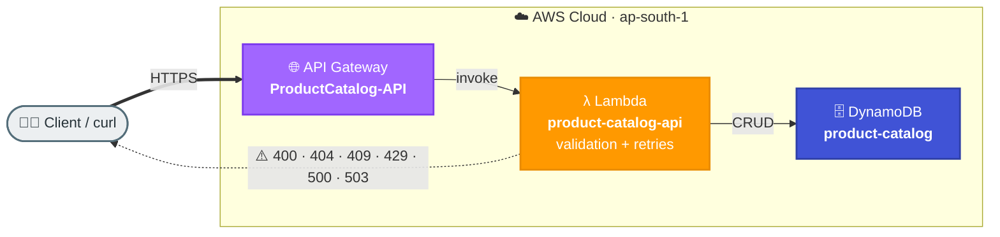

# Task 6: Common API and Lambda Failure Handling

## Goal
Handle common serverless API failures gracefully with useful HTTP status codes and consistent JSON error responses.

## Architecture


## Resources Created
| Service | Resource | Purpose |
|---|---|---|
| API Gateway | ProductCatalog-API | Product API routes |
| Lambda | product-catalog-api | CRUD logic and error handling |
| DynamoDB | product-catalog | Product data storage |

## Base URL
```text
https://2510k20042.execute-api.ap-south-1.amazonaws.com/dev
```

## Endpoints
| Method | Path | Description |
|---|---|---|
| GET | /products | List products |
| GET | /products/{id} | Get a product |
| POST | /products | Create product |
| PUT | /products/{id} | Update stock |

## Failure Scenarios Covered
| Scenario | HTTP Code | Handling |
|---|---:|---|
| Missing required fields | 400 | Input validation |
| Malformed JSON | 400 | JSONDecodeError handling |
| Item not found | 404 | Existence check |
| Duplicate product | 409 | Conflict response |
| Throttling | 429 | Retry-After guidance |
| DynamoDB timeout | 503 | Retry with backoff |
| Lambda nearing timeout | 504 | Remaining-time guard |

## Step-by-Step Setup
1. Create DynamoDB table `product-catalog` with partition key `productId`.
2. Seed table with sample products such as `P001`.
3. Create Lambda `product-catalog-api`.
4. Implement validation, not-found checks, duplicate checks, and retry handling.
5. Create API Gateway `ProductCatalog-API`.
6. Add routes for list, get, create, and update.
7. Test both success and error paths.

## How to Run / Demo
```bash
curl -s https://2510k20042.execute-api.ap-south-1.amazonaws.com/dev/products

curl -s https://2510k20042.execute-api.ap-south-1.amazonaws.com/dev/products/P001

curl -s https://2510k20042.execute-api.ap-south-1.amazonaws.com/dev/products/DOESNT_EXIST

curl -s -X POST https://2510k20042.execute-api.ap-south-1.amazonaws.com/dev/products   -H "Content-Type: application/json"   -d "this is not json"

curl -s -X POST https://2510k20042.execute-api.ap-south-1.amazonaws.com/dev/products   -H "Content-Type: application/json"   -d '{"name":"Test"}'

curl -s -X POST https://2510k20042.execute-api.ap-south-1.amazonaws.com/dev/products   -H "Content-Type: application/json"   -d '{"productId":"P001","name":"Dup","price":100,"category":"Test"}'

curl -s -X PUT https://2510k20042.execute-api.ap-south-1.amazonaws.com/dev/products/P001   -H "Content-Type: application/json"   -d '{"stock":-5}'
```

## What to Verify
- Success calls return 200-level responses.
- Invalid input returns 400.
- Missing products return 404.
- Duplicate products return 409.
- Error responses are predictable and readable.
