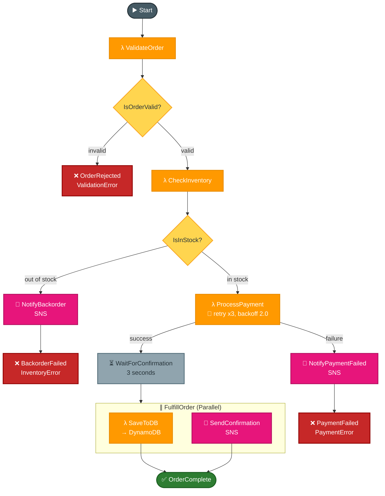

# Task 1: Multi-Step Workflow with AWS Step Functions

## Goal
Build an order-processing workflow using Step Functions to coordinate multiple Lambda functions, retries, failure paths, SNS notifications, and a DynamoDB write.

## Architecture


## Files
| File | Purpose |
|---|---|
| validate_order.py | Validates order fields and calculates total |
| check_inventory.py | Checks simulated inventory levels |
| process_payment.py | Simulates payment success/failure |
| update_order.py | Saves successful order to DynamoDB |
| state-machine.json | Amazon States Language definition |

## Resources Created
| Service | Resource |
|---|---|
| Lambda | validate-order |
| Lambda | check-inventory |
| Lambda | process-payment |
| Lambda | update-order |
| Step Functions | OrderProcessingWorkflow |
| DynamoDB | order-processing |
| SNS | order-notifications |

## Step-by-Step Setup
1. Create IAM role for Lambda execution.
2. Create IAM role for Step Functions execution.
3. Package and deploy four Lambda functions.
4. Create DynamoDB table `order-processing`.
5. Create SNS topic `order-notifications` and subscribe an email address.
6. Update `state-machine.json` with Lambda and SNS ARNs.
7. Create Step Functions state machine from the ASL definition.
8. Run happy-path and failure-path executions.

## How to Run / Demo
```bash
aws stepfunctions start-execution   --state-machine-arn arn:aws:states:ap-south-1:353211646521:stateMachine:OrderProcessingWorkflow   --input '{"order":{"customerId":"C001","items":[{"productId":"PROD-001","quantity":1,"price":2499}],"shippingAddress":"Bangalore"}}'   --region ap-south-1 --no-verify-ssl
```

### Out-of-Stock Test
Use product `PROD-003`, which has stock `0`.

### Payment Failure Test
Use a `customerId` ending in `FAIL`, for example `C001-FAIL`.

### Invalid Order Test
Omit required fields like `customerId`, `items`, or `shippingAddress`.

## What to Verify
- Happy path reaches `SUCCEEDED`.
- Out-of-stock path sends SNS notification and fails with inventory error.
- Payment failure retries before failing.
- Successful orders are saved in DynamoDB.

## End-to-End Flow, Solution & Service Choices
1. Order payload enters the workflow execution.
2. Step Functions orchestrates validation, inventory check, payment, and update steps.
3. Choice states branch between success and failure paths.
4. Retries and catches handle transient failures and route terminal errors.
5. Success/failure notifications are published and final status is returned.

### Why this solution
- Multi-step order processing needs explicit orchestration, not ad-hoc chained Lambda calls.
- State machines provide auditability, retries, branching, and deterministic failure handling.

### Why these AWS services
- Step Functions: durable orchestration with visual workflow, retries, and error routing.
- Lambda: independent task functions for each business responsibility.
- DynamoDB: order state persistence with low-latency updates.
- SNS: operational/business notifications for workflow outcomes.
