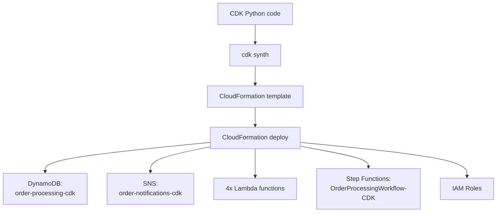

# Task 2: Deploy Infrastructure Using AWS CDK

## Goal
Recreate the Step Functions order-processing infrastructure as code using AWS CDK in Python, then deploy it through CloudFormation.

## Architecture


## Resources Created
| Service | Resource |
|---|---|
| DynamoDB | order-processing-cdk |
| SNS | order-notifications-cdk |
| Lambda | validate-order-cdk |
| Lambda | check-inventory-cdk |
| Lambda | process-payment-cdk |
| Lambda | update-order-cdk |
| Step Functions | OrderProcessingWorkflow-CDK |
| CloudFormation | OrderProcessingStack |

## Key Files
| File/Folder | Purpose |
|---|---|
| app.py | CDK app entry point |
| cdk/order_processing_stack.py | Main CDK stack definition |
| lambda/step_functions/ | Lambda source code used by CDK |
| requirements.txt | Python CDK dependencies |
| cdk.json | CDK CLI configuration |

## Important CDK Concepts Used
- `dynamodb.Table` creates the order table.
- `sns.Topic` creates the notification topic.
- `lambda.Function` creates each Lambda.
- `Code.from_inline()` embeds Lambda code directly in the template to avoid CDK bootstrap constraints.
- `order_table.grant_read_write_data(update_order_fn)` creates least-scoped DynamoDB IAM permissions.
- `tasks.LambdaInvoke` creates Step Functions Lambda tasks.
- `sfn.Choice`, `sfn.Fail`, `sfn.Wait`, and `sfn.Parallel` build the workflow.
- `CfnOutput` exposes stack outputs.

## Step-by-Step Setup
1. Install Python dependencies.
2. Verify AWS credentials for account `353211646521` and region `ap-south-1`.
3. Run `cdk synth` to generate a CloudFormation template.
4. Deploy the template with CloudFormation.
5. Confirm the stack reaches `CREATE_COMPLETE` or `UPDATE_COMPLETE`.
6. Start a Step Functions execution to validate the deployment.

## How to Run Locally
```bash
cd week2/task2-cdk
pip install -r requirements.txt
cdk synth
```

## Deploy Command
```bash
aws cloudformation create-stack   --stack-name OrderProcessingStack   --template-body file://cdk.out/OrderProcessingStack.template.json   --capabilities CAPABILITY_NAMED_IAM   --region ap-south-1   --no-verify-ssl
```

For updates:
```bash
aws cloudformation update-stack   --stack-name OrderProcessingStack   --template-body file://cdk.out/OrderProcessingStack.template.json   --capabilities CAPABILITY_NAMED_IAM   --region ap-south-1   --no-verify-ssl
```

## Test Command
```bash
aws stepfunctions start-execution   --state-machine-arn arn:aws:states:ap-south-1:353211646521:stateMachine:OrderProcessingWorkflow-CDK   --input '{"order":{"customerId":"C001","items":[{"productId":"PROD-001","quantity":1,"price":2499}],"shippingAddress":"CDK Deployed, Bangalore"}}'   --region ap-south-1   --no-verify-ssl
```

## What to Verify
- CloudFormation stack `OrderProcessingStack` exists.
- Stack outputs include `StateMachineArn`, `TableName`, and `TopicArn`.
- Step Functions execution succeeds.
- DynamoDB table `order-processing-cdk` contains the confirmed order.
