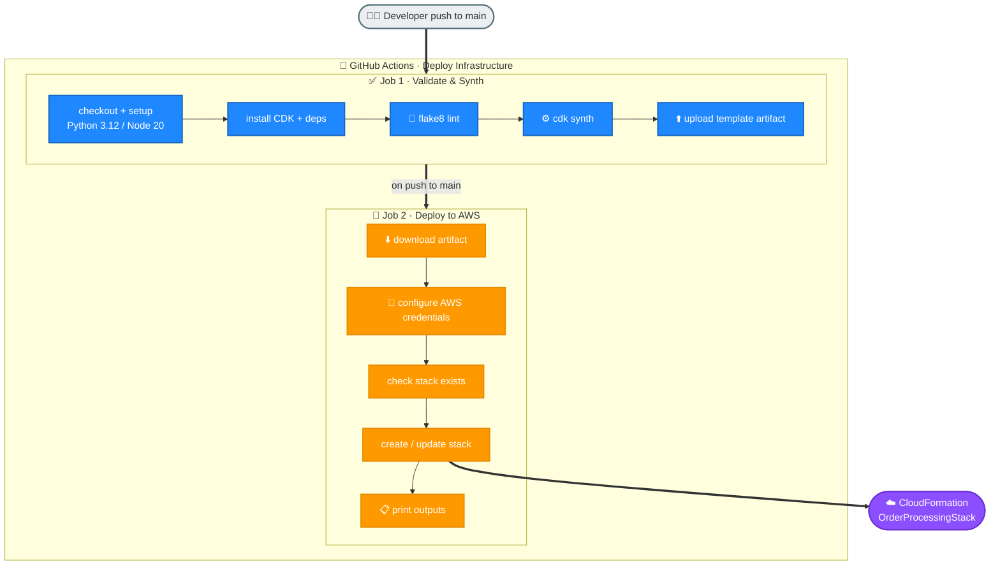

# Task 3: GitHub Actions Deployment Pipeline

## Goal
Create a CI/CD pipeline that validates infrastructure code and deploys the CDK-generated CloudFormation template to AWS.

## Architecture


## Workflow File
The workflow must stay at repo root:
```text
.github/workflows/deploy.yml
```
GitHub Actions only detects workflow files from `.github/workflows/` at the top level.

## Trigger Rules
The workflow runs on:
- Manual trigger: `workflow_dispatch`
- Push to `main`
- Pull request to `main`

Path filters include:
```text
week2/task2-cdk/cdk/**
week2/task2-cdk/lambda/**
week2/task2-cdk/app.py
week2/task2-cdk/requirements.txt
.github/workflows/**
```

## Jobs
### 1. Validate & Synth
Runs on pushes and pull requests.

Steps:
1. Checkout source code.
2. Set up Python 3.12.
3. Set up Node.js 20 for CDK CLI.
4. Install CDK CLI with `npm install -g aws-cdk`.
5. Install Python dependencies from `week2/task2-cdk/requirements.txt`.
6. Run flake8 on Lambda code.
7. Run `cd week2/task2-cdk && cdk synth --quiet`.
8. Upload `OrderProcessingStack.template.json` as an artifact.

### 2. Deploy to AWS
Runs only for push to `main` when `DEPLOY_ENABLED=true`.

Steps:
1. Download synthesized CloudFormation template artifact.
2. Configure AWS credentials using GitHub Actions secrets.
3. Check whether `OrderProcessingStack` already exists.
4. Create stack if missing, otherwise update stack.
5. Handle `No updates are to be performed` gracefully.
6. Print CloudFormation stack outputs.

## Required GitHub Secrets
| Secret | Purpose |
|---|---|
| AWS_ACCESS_KEY_ID | AWS authentication |
| AWS_SECRET_ACCESS_KEY | AWS authentication |
| AWS_SESSION_TOKEN | Temporary SSO session token |

## Required GitHub Variable
| Variable | Value | Purpose |
|---|---|---|
| DEPLOY_ENABLED | true | Enables deploy job |

## Step-by-Step Setup
1. Create repository `abhi-achar/aws-hands-on-training`.
2. Add `.github/workflows/deploy.yml` at repo root.
3. Add AWS secrets under GitHub repo Settings -> Secrets and variables -> Actions.
4. Add repo variable `DEPLOY_ENABLED=true`.
5. Push code to `main`.
6. Open the Actions tab and watch the workflow.
7. Confirm `Validate & Synth` succeeds.
8. Confirm `Deploy to AWS` succeeds.

## How to Run / Demo
Trigger by pushing a workflow/CDK/Lambda change:
```bash
git add .
git commit -m "ci: test deployment pipeline"
git push origin main
```

Or run manually from GitHub:
```text
GitHub repo -> Actions -> Deploy Infrastructure -> Run workflow
```

## Current Repo
```text
https://github.com/abhi-achar/aws-hands-on-training
```

## What to Verify
- Latest workflow run is green.
- Validate job passes lint and CDK synth.
- Deploy job updates `OrderProcessingStack`.
- Stack outputs are printed in the workflow logs.

## End-to-End Flow, Solution & Service Choices
1. Developer pushes changes to the repository.
2. GitHub Actions validate job runs linting and template synthesis.
3. If validation passes, deploy job authenticates to AWS and deploys template.
4. Pipeline publishes run status for traceability.

### Why this solution
- Automated pipelines reduce human error and enforce quality gates before cloud changes.
- CI/CD shortens delivery cycles while preserving deployment consistency across updates.

### Why these AWS/services
- GitHub Actions: native repo-integrated CI/CD with reusable workflow stages.
- CloudFormation: deterministic deploy target from synthesized template.
- IAM + AWS credentials: controlled deployment permissions for automation.
- CDK synth artifacts: consistent infrastructure package handed to deploy stage.
