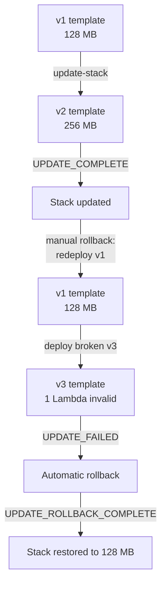

# Task 4: Test Deployment and Rollback Scenarios

## Goal
Validate that infrastructure changes can be deployed safely and rolled back reliably using AWS CloudFormation. This task demonstrates both a manual rollback and CloudFormation's automatic rollback on a failed update, using the Task 2 CDK stack (`OrderProcessingStack`).

## Concept
Every CloudFormation `update-stack` is transactional:
- If all resource updates succeed, the stack reaches `UPDATE_COMPLETE`.
- If any resource update fails, CloudFormation automatically rolls the entire stack back to its last known-good state (`UPDATE_ROLLBACK_COMPLETE`).

The test changes a low-risk property (Lambda `MemorySize`) so the deploy/rollback effect is easy to observe.

## Architecture


## Template Versions
| Template | Description |
|---|---|
| templates/v1-128mb.template.json | Baseline: all 4 Lambdas at 128 MB |
| templates/v2-256mb.template.json | Update: all 4 Lambdas at 256 MB |
| templates/v3-broken.template.json | Broken: 3 Lambdas at 512 MB, 1 Lambda at invalid 999999 MB |

## Scenario A: Successful Deploy + Manual Rollback

### A1. Baseline
```bash
aws lambda get-function-configuration \
  --function-name validate-order-cdk \
  --region ap-south-1 --no-verify-ssl
# MemorySize: 128
```

### A2. Deploy update (v2, 256 MB)
```bash
aws cloudformation update-stack \
  --stack-name OrderProcessingStack \
  --template-body file://templates/v2-256mb.template.json \
  --capabilities CAPABILITY_NAMED_IAM \
  --region ap-south-1 --no-verify-ssl

aws cloudformation wait stack-update-complete \
  --stack-name OrderProcessingStack \
  --region ap-south-1 --no-verify-ssl
```
Result: Stack `UPDATE_COMPLETE`, all Lambdas now 256 MB.

### A3. Manual rollback (redeploy v1, 128 MB)
```bash
aws cloudformation update-stack \
  --stack-name OrderProcessingStack \
  --template-body file://templates/v1-128mb.template.json \
  --capabilities CAPABILITY_NAMED_IAM \
  --region ap-south-1 --no-verify-ssl

aws cloudformation wait stack-update-complete \
  --stack-name OrderProcessingStack \
  --region ap-south-1 --no-verify-ssl
```
Result: Stack `UPDATE_COMPLETE`, all Lambdas back to 128 MB.

## Scenario B: Failed Deploy + Automatic Rollback

### B1. Deploy a broken update (v3)
The broken template bumps 3 Lambdas to 512 MB and sets one Lambda to an invalid 999999 MB (above the 10240 MB limit).
```bash
aws cloudformation update-stack \
  --stack-name OrderProcessingStack \
  --template-body file://templates/v3-broken.template.json \
  --capabilities CAPABILITY_NAMED_IAM \
  --region ap-south-1 --no-verify-ssl
```

### B2. CloudFormation auto-rolls back
```bash
aws cloudformation wait stack-rollback-complete \
  --stack-name OrderProcessingStack \
  --region ap-south-1 --no-verify-ssl
```
Observed stack event sequence:
```text
UPDATE_FAILED                  AWS::Lambda::Function  Resource update cancelled
UPDATE_ROLLBACK_IN_PROGRESS    AWS::CloudFormation::Stack  The following resource(s) failed to update
UPDATE_ROLLBACK_COMPLETE_CLEANUP_IN_PROGRESS
UPDATE_ROLLBACK_COMPLETE
```

### B3. Verify full revert
```bash
for fn in validate-order-cdk check-inventory-cdk process-payment-cdk update-order-cdk; do
  aws lambda get-function-configuration --function-name "$fn" \
    --region ap-south-1 --no-verify-ssl \
    --query "MemorySize"
done
```
Result: all 4 Lambdas at 128 MB. Even the 3 Lambdas that briefly updated to 512 MB were reverted, because CloudFormation rolls the whole update back atomically.

## Inspect Stack Events
```bash
aws cloudformation describe-stack-events \
  --stack-name OrderProcessingStack \
  --region ap-south-1 --no-verify-ssl \
  --query "StackEvents[?contains(ResourceStatus, 'ROLLBACK') || contains(ResourceStatus, 'FAILED')].[ResourceStatus, ResourceType, ResourceStatusReason]" \
  --output table
```

## Results Summary
| Scenario | Trigger | Final Stack Status | Lambda Memory |
|---|---|---|---|
| A2 Deploy | update to v2 | UPDATE_COMPLETE | 256 MB |
| A3 Manual rollback | redeploy v1 | UPDATE_COMPLETE | 128 MB |
| B Failed deploy | update to v3 (invalid) | UPDATE_ROLLBACK_COMPLETE | 128 MB |

## Key Takeaways
- Manual rollback is achieved by redeploying a previous known-good template.
- Automatic rollback is built into CloudFormation for failed updates; no manual action is required.
- Rollbacks are atomic: partial successful changes within a failed update are also reverted.
- Storing template versions (v1, v2) makes manual rollback fast and predictable.
