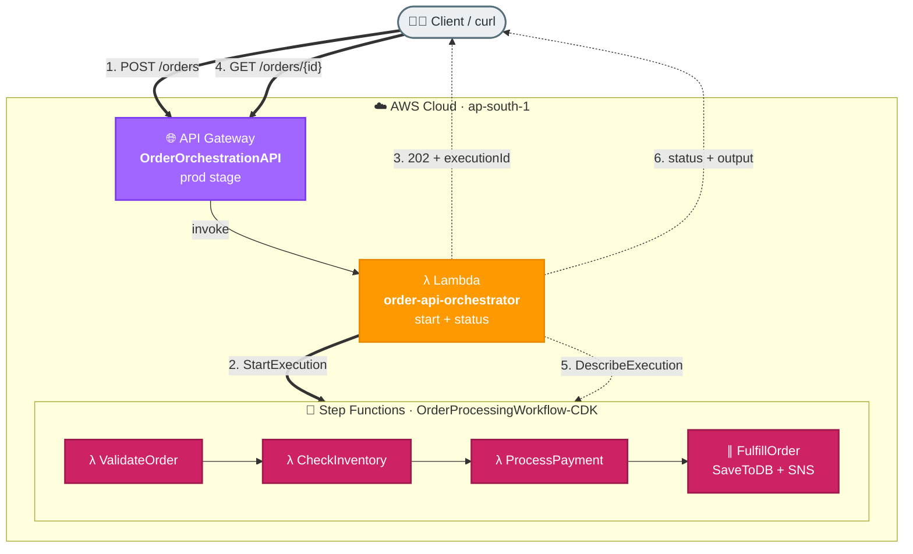

# Task 5: Integrate Orchestration into Existing Serverless Workflows

## Goal
Expose the existing Step Functions orchestration (`OrderProcessingWorkflow-CDK` from Task 2) through a standard serverless API. A client can submit an order to an API Gateway endpoint, which triggers the orchestration, and then poll a status endpoint for the result. This integrates a long-running orchestrated workflow into a simple synchronous-style serverless API.

## Architecture


## Concept
The Task 1 / Task 2 Step Functions workflow is asynchronous and was previously
triggered only from the CLI (`aws stepfunctions start-execution`). This task
puts a serverless API in front of it:

- `POST /orders` → Lambda calls `StartExecution` and immediately returns `202 Accepted` with an execution id (non-blocking).
- `GET /orders/{id}` → Lambda calls `DescribeExecution` and returns the current status and final output.

This is the standard pattern for integrating orchestration into an API without
making the client wait for the whole workflow to finish.

## Resources Created
| Service | Resource | Purpose |
|---|---|---|
| API Gateway | OrderOrchestrationAPI | REST API front door (prod stage) |
| Lambda | order-api-orchestrator | Starts execution and reports status |
| IAM Role | order-api-lambda-role | Allows StartExecution + DescribeExecution |
| Step Functions | OrderProcessingWorkflow-CDK | Existing orchestration (reused) |

## Base URL
```text
https://r6k62pk8oj.execute-api.ap-south-1.amazonaws.com/prod
```

## Endpoints
| Method | Path | Description |
|---|---|---|
| POST | /orders | Submit an order, start the orchestration |
| GET | /orders/{id} | Get execution status and final output |

## Step-by-Step Setup
1. Create IAM role `order-api-lambda-role` with a Lambda trust policy.
2. Attach `AWSLambdaBasicExecutionRole` and an inline policy allowing `states:StartExecution` and `states:DescribeExecution` on the target state machine.
3. Create Lambda `order-api-orchestrator` (Python 3.12) with `STATE_MACHINE_ARN` environment variable.
4. Create REST API `OrderOrchestrationAPI` (regional).
5. Create resource `/orders` with a `POST` method (Lambda proxy integration).
6. Create resource `/orders/{id}` with a `GET` method (Lambda proxy integration).
7. Grant API Gateway permission to invoke the Lambda.
8. Deploy the API to the `prod` stage.

## How to Run / Demo

### Start an order (happy path)
```bash
curl -s -X POST https://r6k62pk8oj.execute-api.ap-south-1.amazonaws.com/prod/orders \
  -H "Content-Type: application/json" \
  -d '{"order":{"customerId":"C500","items":[{"productId":"PROD-001","quantity":2,"price":2499}],"shippingAddress":"Bangalore"}}'
```
Response:
```json
{
  "message": "Order accepted and orchestration started",
  "executionId": "api-7e506bd1d119",
  "statusUrl": "/orders/api-7e506bd1d119"
}
```

### Check status
```bash
curl -s https://r6k62pk8oj.execute-api.ap-south-1.amazonaws.com/prod/orders/api-7e506bd1d119
```
Response (after completion):
```json
{
  "executionId": "api-7e506bd1d119",
  "status": "SUCCEEDED",
  "output": {
    "finalStatus": "Order processing completed successfully",
    "orderResult": {
      "orderId": "ORD-F92486E3",
      "status": "CONFIRMED",
      "orderTotal": 4998,
      "paymentId": "PAY-28D55C06"
    }
  }
}
```

### Out-of-stock path (orchestration branch)
```bash
curl -s -X POST https://r6k62pk8oj.execute-api.ap-south-1.amazonaws.com/prod/orders \
  -H "Content-Type: application/json" \
  -d '{"order":{"customerId":"C501","items":[{"productId":"PROD-003","quantity":1,"price":499}],"shippingAddress":"Test"}}'
# then GET the status -> "status": "FAILED" (inventory branch triggered)
```

## Test Results
| Scenario | Input | Execution Status |
|---|---|---|
| Happy path | PROD-001 | SUCCEEDED |
| Out of stock | PROD-003 (0 stock) | FAILED |

## What to Verify
- `POST /orders` returns `202` with an execution id immediately (non-blocking).
- `GET /orders/{id}` returns `RUNNING` then `SUCCEEDED`/`FAILED`.
- The same orchestration handles both success and failure branches when driven through the API.
- The Lambda has only the minimal `StartExecution` and `DescribeExecution` permissions.

## Files
| File | Purpose |
|---|---|
| lambda/order_api.py | Lambda that starts execution and reports status |
| iam/trust-policy.json | Lambda assume-role trust policy |
| iam/sfn-invoke-policy.json | Inline policy for Step Functions access |
| setup_api.py | Script that wires API Gateway to the Lambda and deploys |
