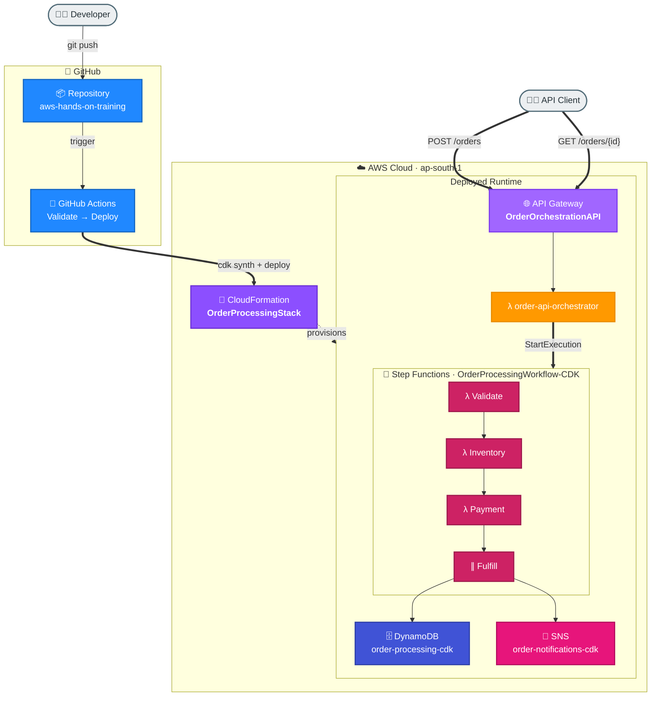

# Task 6: Weekly Deliverable — Deployed Workflow with Automated CI/CD and Orchestration

## Summary
This is the consolidated Week 2 deliverable. It ties together every Week 2 task into one working, deployed system: a serverless order-processing **orchestration**, defined as **infrastructure as code**, shipped through an **automated CI/CD pipeline**, protected by **deployment & rollback** safety, and exposed through a **serverless API**.

## Deliverable Checklist
| Requirement | Implemented By | Status |
|---|---|---|
| Deployed workflow (orchestration) | Step Functions `OrderProcessingWorkflow-CDK` (Task 1) | Live |
| Infrastructure as Code | AWS CDK stack `OrderProcessingStack` (Task 2) | Deployed |
| Automated CI/CD pipeline | GitHub Actions `deploy.yml` (Task 3) | Passing |
| Deployment & rollback safety | CloudFormation transactional updates (Task 4) | Validated |
| Orchestration integration | API Gateway + Lambda front-end (Task 5) | Live |

## End-to-End Architecture


## How the Pieces Connect
1. A developer pushes code to GitHub.
2. **GitHub Actions** lints, runs `cdk synth`, and deploys the CloudFormation template (Task 3).
3. **CloudFormation** provisions the entire stack from the **CDK** definition (Task 2) and supports safe **rollback** (Task 4).
4. The deployed stack includes the **Step Functions orchestration** (Task 1) plus DynamoDB and SNS.
5. An **API Gateway + Lambda** front-end lets clients drive the orchestration over HTTP (Task 5).

## Live Endpoints
| Component | Identifier |
|---|---|
| API base URL | https://r6k62pk8oj.execute-api.ap-south-1.amazonaws.com/prod |
| State machine ARN | arn:aws:states:ap-south-1:353211646521:stateMachine:OrderProcessingWorkflow-CDK |
| CloudFormation stack | OrderProcessingStack |
| CI/CD pipeline | .github/workflows/deploy.yml |
| Repository | https://github.com/abhi-achar/aws-hands-on-training |

## Run the End-to-End Demo
```bash
cd week2/task6-weekly-deliverable
bash demo.sh
```
The script submits two orders through the API and polls each orchestration to completion.

## Verified Demo Results
| Scenario | Input | Orchestration Result | Order Output |
|---|---|---|---|
| Happy path | PROD-002 x2 | SUCCEEDED | ORD-525C5349, total 2400, PAY-39E8B0C3 |
| Out of stock | PROD-003 (0 stock) | FAILED | inventory branch triggered |

Example happy-path response:
```json
{
  "executionId": "api-1c7d14e891db",
  "status": "SUCCEEDED",
  "output": {
    "finalStatus": "Order processing completed successfully",
    "orderResult": {
      "orderId": "ORD-525C5349",
      "status": "CONFIRMED",
      "orderTotal": 2400,
      "paymentId": "PAY-39E8B0C3"
    }
  }
}
```

## System Health (verified)
| Component | State |
|---|---|
| CloudFormation `OrderProcessingStack` | Healthy (last action: rollback test from Task 4) |
| Step Functions `OrderProcessingWorkflow-CDK` | ACTIVE |
| API Gateway `OrderOrchestrationAPI` | prod stage live |
| GitHub Actions latest run | success |

## Task Index
| Task | Folder |
|---|---|
| 1 · Step Functions | [week2/task1-step-functions](../task1-step-functions) |
| 2 · CDK | [week2/task2-cdk](../task2-cdk) |
| 3 · CI/CD | [week2/task3-ci-cd](../task3-ci-cd) |
| 4 · Deployment & Rollback | [week2/task4-deployment-rollback](../task4-deployment-rollback) |
| 5 · Orchestration Integration | [week2/task5-orchestration-integration](../task5-orchestration-integration) |
| 6 · Weekly Deliverable | this folder |

## End-to-End Flow, Solution & Service Choices
1. Infrastructure is modeled as CDK and synthesized to CloudFormation.
2. GitHub Actions validates and deploys cloud resources automatically.
3. API layer accepts orders and starts Step Functions orchestration.
4. Workflow runs validation, inventory, payment, and persistence steps.
5. Monitoring and rollback controls protect production stability.

### Why this solution
- The combined architecture demonstrates a production-like SDLC: design, deploy, validate, operate, and recover.
- It balances agility (CI/CD + serverless) with governance (IaC + rollback + monitoring).

### Why these AWS services
- CDK + CloudFormation: reliable and auditable infrastructure lifecycle.
- GitHub Actions: automated quality and deployment gates.
- API Gateway + Lambda: scalable API integration layer.
- Step Functions: robust orchestration for business transactions.
- DynamoDB/SNS/CloudWatch: state, notifications, and observability pillars.
