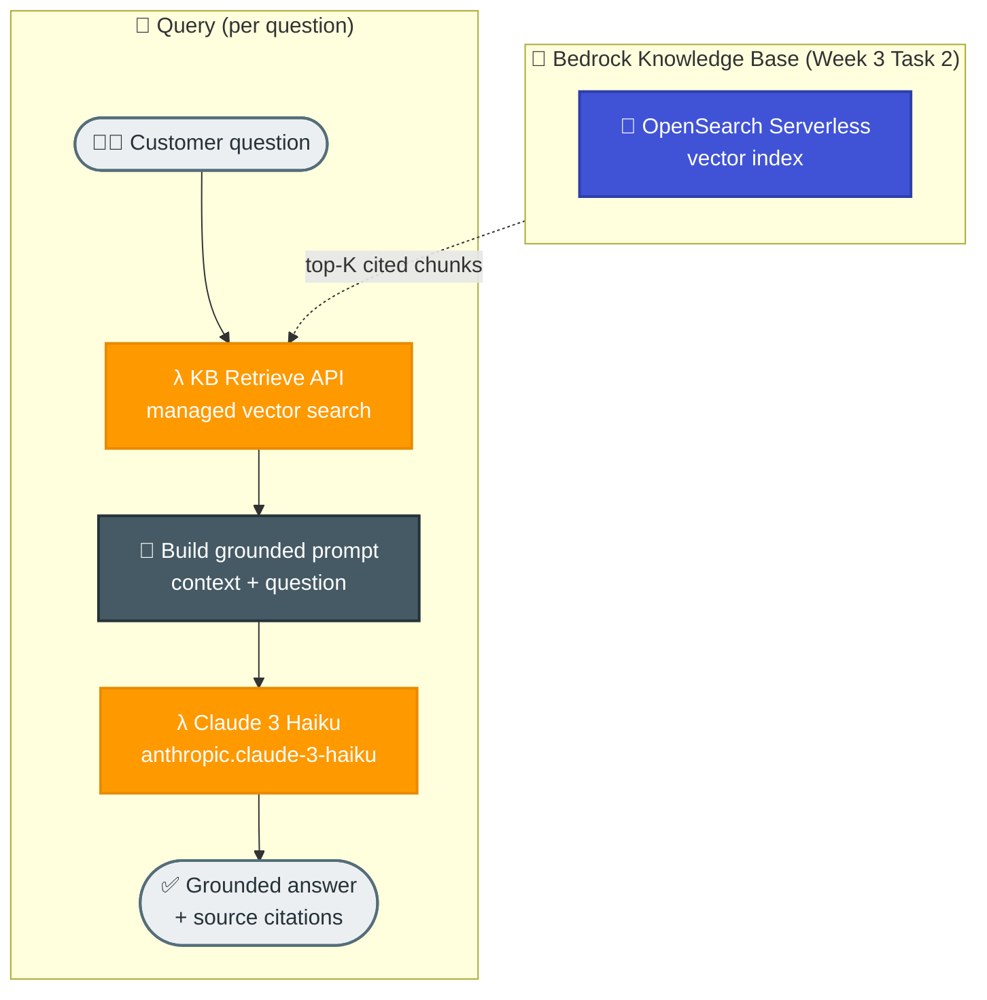

# Task 1: RAG-Based Assistant using Amazon Bedrock

## Goal
Build a simple but realistic Retrieval-Augmented Generation (RAG) assistant on Amazon Bedrock. The example is a **customer-support assistant for a fictional e-commerce store, "NovaCart"** — the same store whose order-processing backend was built in Week 2. The assistant answers customer questions (shipping, returns, payments, orders, accounts) grounded **only** in NovaCart's help-center documents, and cites its sources.

This is the most common real-world use of RAG: grounding an LLM in your own private knowledge so it gives accurate, up-to-date, cited answers instead of hallucinating.

## Why RAG?
A plain LLM does not know NovaCart's shipping fees or return window, and may invent answers. RAG fixes this by:
1. Retrieving the most relevant company documents for each question.
2. Injecting them into the prompt as grounding context.
3. Asking the model to answer **only** from that context and cite sources.

## Architecture


## Bedrock Models Used
| Role | Model | Notes |
|------|-------|-------|
| Embeddings | `amazon.titan-embed-text-v2:0` | 1024-dim vectors for documents and queries |
| Generation | `anthropic.claude-3-haiku-20240307-v1:0` | Fast, low-cost grounded answer generation |

Retrieval is served by the managed Amazon Bedrock Knowledge Base provisioned in
Week 3 Task 2 (vector store = Amazon OpenSearch Serverless). This script resolves
the Knowledge Base by name and calls its `Retrieve` API, then generates the
answer with Claude 3 Haiku - citing the source documents.

## Knowledge Base
| Document | Topics |
|----------|--------|
| knowledge_base/shipping-delivery.md | shipping methods, timelines, costs, delays |
| knowledge_base/returns-refunds.md | return window, refund timing, non-returnable items |
| knowledge_base/payments-billing.md | payment methods, failed payments, EMI, refunds |
| knowledge_base/orders-tracking.md | order statuses, tracking, cancellation |
| knowledge_base/account-security.md | login, password reset, privacy, scams |

## Project Files
| File | Purpose |
|------|---------|
| rag_assistant.py | RAG pipeline: Knowledge Base retrieve + Claude generation with citations |
| knowledge_base/ | Source help-center documents (uploaded to the KB's S3 data source in Task 2) |
| requirements.txt | Python dependency (boto3) |

## How to Run

### 1. Install dependencies
```bash
cd week3/task1-rag-assistant
pip install -r requirements.txt
```

Retrieval uses the managed Knowledge Base from Task 2 — there is no local ingestion step. Ensure that Knowledge Base exists first (see `week3/task2-doc-ingestion`).

### 2. Ask a question
```bash
python rag_assistant.py ask "How long does standard shipping take and is it free?"
```

### 3. Interactive chat
```bash
python rag_assistant.py chat
```

### Troubleshooting: Unable to locate credentials
If you see `NoCredentialsError` or `Unable to locate credentials`, set AWS credentials in the same terminal before running Task 1:

```bash
export AWS_ACCESS_KEY_ID="<your_access_key>"
export AWS_SECRET_ACCESS_KEY="<your_secret_key>"
export AWS_SESSION_TOKEN="<your_session_token>"
export AWS_REGION="ap-south-1"
```

Then verify and rerun:

```bash
aws sts get-caller-identity
python rag_assistant.py ask "How long does standard shipping take and is it free?"
```

## Verified Sample Q&A

**Q: How long does standard shipping take and is it free?**
> Standard shipping within India takes 4–6 business days. It is free for orders over INR 499, otherwise it costs INR 49. *[shipping-delivery.md]*

**Q: My payment failed but money was deducted. What happens now?**
> It is an automatic hold that the bank reverses within 5–7 business days. No order is created for a failed payment, so you can safely retry. *[payments-billing.md]*

**Q: Can I return earphones I bought?**
> Earphones cannot be returned — they are listed as non-returnable for hygiene and safety reasons. *[returns-refunds.md]*

**Q: Who is the CEO of NovaCart and what is the stock price?**
> The assistant declines: this information is not in the knowledge base, and suggests contacting support. (No hallucination.)

## How It Works (Code Walkthrough)
1. **Retrieve** — the question is sent to the Bedrock Knowledge Base `Retrieve` API, which embeds it and runs vector search in OpenSearch Serverless; the top chunks come back with source and score.
2. **Augment** — the retrieved chunks are inserted into a prompt that instructs the model to answer only from the context and cite sources.
3. **Generate** — Claude 3 Haiku produces a concise, grounded answer with citations.

## Key Takeaways
- RAG grounds an LLM in private data without retraining the model.
- A managed Bedrock Knowledge Base handles embedding and vector search, so the app only retrieves and generates.
- A strict prompt ("answer only from context") prevents hallucination and enables citations.
- The same retrieve-then-generate pattern scales from a handful of docs to large corpora.

## End-to-End Flow, Solution & Service Choices
1. Help-center documents are ingested into the Task 2 Bedrock Knowledge Base (OpenSearch Serverless vector store).
2. The user question is sent to the Knowledge Base `Retrieve` API.
3. The Knowledge Base embeds the query and returns the top relevant chunks with sources.
4. Retrieved chunks are injected into the prompt as grounding context.
5. Claude generates an answer constrained to the retrieved context, with citations.

### Why this solution
- RAG improves factual accuracy for domain-specific support without expensive fine-tuning.
- Retrieval + grounded prompting is faster to update when policies/docs change.

### Why these AWS services
- Amazon Bedrock: managed access to foundation models and Knowledge Bases under one API.
- Bedrock Knowledge Base + Titan embeddings: managed chunking, embedding, and retrieval.
- OpenSearch Serverless: managed vector store with approximate-nearest-neighbour search.
- Claude model family: high-quality instruction following and customer-support response quality.
