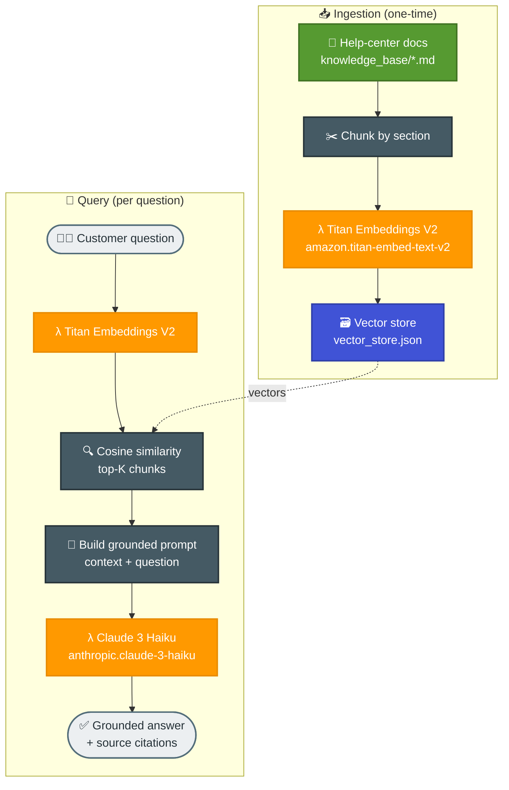

# Task 1: RAG-Based Assistant using Amazon Bedrock

## Goal
Build a simple but realistic Retrieval-Augmented Generation (RAG) assistant on Amazon Bedrock. The example is a **customer-support assistant for a fictional e-commerce store, "NovaCart"** — the same store whose order-processing backend was built in Week 2. The assistant answers customer questions (shipping, returns, payments, orders, accounts) grounded **only** in NovaCart's help-center documents, and cites its sources.

This is the most common real-world use of RAG: grounding an LLM in your own private knowledge so it gives accurate, up-to-date, cited answers instead of hallucinating.

## Why RAG?
A plain LLM does not know NovaCart's shipping fees or return window, and may invent answers. RAG fixes this by:
1. Retrieving the most relevant company documents for each question.
2. Injecting them into the prompt as grounding context.
3. Asking the model to answer **only** from that context and cite sources.

## Architecture


## Bedrock Models Used
| Role | Model | Notes |
|------|-------|-------|
| Embeddings | `amazon.titan-embed-text-v2:0` | 1024-dim vectors for documents and queries |
| Generation | `anthropic.claude-3-haiku-20240307-v1:0` | Fast, low-cost grounded answer generation |

A pure in-memory vector store (JSON + NumPy cosine similarity) is used instead of
OpenSearch or a managed Bedrock Knowledge Base, so the example is fully
self-contained and needs no extra infrastructure.

## Knowledge Base
| Document | Topics |
|----------|--------|
| knowledge_base/shipping-delivery.md | shipping methods, timelines, costs, delays |
| knowledge_base/returns-refunds.md | return window, refund timing, non-returnable items |
| knowledge_base/payments-billing.md | payment methods, failed payments, EMI, refunds |
| knowledge_base/orders-tracking.md | order statuses, tracking, cancellation |
| knowledge_base/account-security.md | login, password reset, privacy, scams |

## Project Files
| File | Purpose |
|------|---------|
| rag_assistant.py | The full RAG pipeline (ingest, retrieve, generate) |
| knowledge_base/ | Source help-center documents |
| vector_store.json | Generated embeddings (created by `ingest`) |
| requirements.txt | Python dependencies (boto3, numpy) |

## How to Run

### 1. Install dependencies
```bash
cd week3/task1-rag-assistant
pip install -r requirements.txt
```

### 2. Build the knowledge base (embed documents)
```bash
python rag_assistant.py ingest
```
This embeds every document chunk with Titan and writes `vector_store.json`.

### 3. Ask a question
```bash
python rag_assistant.py ask "How long does standard shipping take and is it free?"
```

### 4. Interactive chat
```bash
python rag_assistant.py chat
```

## Verified Sample Q&A

**Q: How long does standard shipping take and is it free?**
> Standard shipping within India takes 4–6 business days. It is free for orders over INR 499, otherwise it costs INR 49. *[shipping-delivery.md]*

**Q: My payment failed but money was deducted. What happens now?**
> It is an automatic hold that the bank reverses within 5–7 business days. No order is created for a failed payment, so you can safely retry. *[payments-billing.md]*

**Q: Can I return earphones I bought?**
> Earphones cannot be returned — they are listed as non-returnable for hygiene and safety reasons. *[returns-refunds.md]*

**Q: Who is the CEO of NovaCart and what is the stock price?**
> The assistant declines: this information is not in the knowledge base, and suggests contacting support. (No hallucination.)

## How It Works (Code Walkthrough)
1. **Ingest** — each markdown doc is split into chunks at `##` section headers; each chunk is embedded with Titan and stored with its source filename.
2. **Retrieve** — the question is embedded, then compared to all chunk vectors using cosine similarity; the top 4 chunks are selected.
3. **Augment** — the retrieved chunks are inserted into a prompt that instructs the model to answer only from the context and cite sources.
4. **Generate** — Claude 3 Haiku produces a concise, grounded answer with citations.

## Key Takeaways
- RAG grounds an LLM in private data without retraining the model.
- Embeddings + cosine similarity are enough to build a working retriever.
- A strict prompt ("answer only from context") prevents hallucination and enables citations.
- The same pattern scales to managed stores (Bedrock Knowledge Bases, OpenSearch) for larger corpora.

## End-to-End Flow, Solution & Service Choices
1. Knowledge-base markdown documents are chunked into retrieval-ready passages.
2. Titan Embeddings model converts chunks into vectors and stores them locally.
3. User question is embedded and matched by cosine similarity.
4. Top relevant chunks are injected into the prompt as grounding context.
5. Claude model generates an answer constrained to retrieved context with citations.

### Why this solution
- RAG improves factual accuracy for domain-specific support without expensive fine-tuning.
- Retrieval + grounded prompting is faster to update when policies/docs change.

### Why these AWS services
- Amazon Bedrock: managed access to multiple foundation models with unified API.
- Titan Embeddings: robust semantic vector generation for retrieval.
- Claude model family: high-quality instruction following and customer-support response quality.
- Local vector store (task scope): simple baseline for proving retrieval logic before managed index scale-out.
