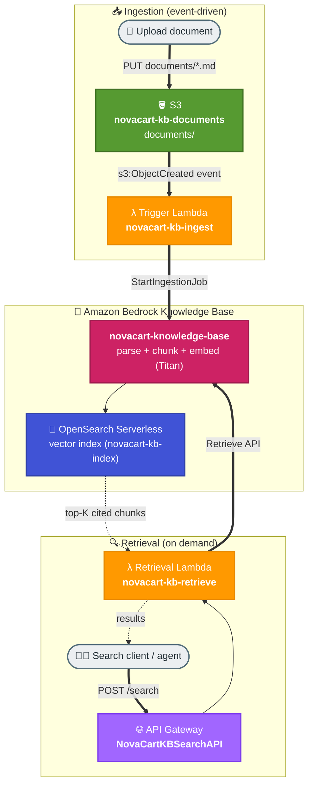

# Task 2: Document Ingestion & Retrieval Workflow

## Goal
Build an automated, event-driven document ingestion and retrieval pipeline on AWS using a **managed Amazon Bedrock Knowledge Base**. Documents dropped into S3 are **automatically** parsed, chunked, embedded with Amazon Titan, and indexed into an Amazon OpenSearch Serverless vector store by the Knowledge Base. A search API then retrieves the most relevant chunks for any query using the Knowledge Base `Retrieve` API.

This is the production backbone that a RAG assistant (Task 1) sits on top of: Task 1 was a local script with in-memory vectors; Task 2 is a real serverless service where ingestion happens automatically on upload and retrieval is exposed over HTTP.

## Real-World Use Case
A growing knowledge base for NovaCart support. The support team simply uploads new or updated help-center documents to an S3 folder. Within seconds the content is searchable through a semantic retrieval API — no manual re-indexing, no servers to manage.

## Architecture


## Why a Managed Bedrock Knowledge Base
Amazon Bedrock Knowledge Bases provide fully managed RAG: they parse documents, chunk them, embed each chunk with Amazon Titan, and store/search the vectors in Amazon OpenSearch Serverless. Instead of maintaining custom chunking, embedding, and cosine-similarity code, the pipeline simply calls the Knowledge Base `Retrieve` API and gets ranked, cited results. This removes undifferentiated heavy lifting and scales to large corpora with real approximate-nearest-neighbour vector search.

## Resources Created
| Service | Resource | Purpose |
|---|---|---|
| S3 | novacart-kb-documents-353211646521 | Document drop zone (documents/ prefix) |
| Bedrock Knowledge Base | novacart-knowledge-base | Managed RAG: parse, chunk, embed, index, retrieve |
| OpenSearch Serverless | bedrock-knowledge-base-a4msz1 / index novacart-kb-index | Vector store for the Knowledge Base |
| Lambda | novacart-kb-ingest | S3-triggered: starts a KB ingestion job |
| Lambda | novacart-kb-retrieve | API-triggered: calls the KB Retrieve API |
| API Gateway | NovaCartKBSearchAPI | POST /search endpoint (prod stage) |
| IAM Role | AmazonBedrockExecutionRoleForKB-novacart | KB access to S3 + Bedrock + OpenSearch |

## Bedrock Model
| Role | Model |
|---|---|
| Embeddings (documents and queries) | `amazon.titan-embed-text-v2:0` (1024-dim) |

## Search API
**Base URL**
```text
https://tdf4du7z9g.execute-api.ap-south-1.amazonaws.com/prod
```
**POST /search**
```json
{ "query": "How long do refunds take?", "topK": 3 }
```
Returns the top-K chunks with their source document and cosine score.

## How It Works
### Ingestion (automatic)
1. A document is uploaded to `s3://novacart-kb-documents-.../documents/`.
2. S3 emits an `ObjectCreated` event that invokes the ingestion trigger Lambda.
3. The Lambda calls the Bedrock Knowledge Base `StartIngestionJob` API.
4. The managed Knowledge Base parses, chunks, embeds (Titan), and indexes the content into the OpenSearch Serverless vector store.

### Retrieval (on demand)
1. A client calls `POST /search` with a query.
2. The retrieval Lambda calls the Knowledge Base `Retrieve` API.
3. The Knowledge Base embeds the query and runs vector search in OpenSearch Serverless.
4. It returns the top-K most relevant chunks, each with its source document and relevance score.

## How to Run / Demo

### Upload documents (triggers ingestion)
```bash
aws s3 cp my-doc.md \
  s3://novacart-kb-documents-353211646521/documents/my-doc.md \
  --no-verify-ssl
```

### Search
```bash
curl -s -X POST https://tdf4du7z9g.execute-api.ap-south-1.amazonaws.com/prod/search \
  -H "Content-Type: application/json" \
  -d '{"query":"How long do refunds take to reach my account?","topK":3}'
```

## Verified Results
After the Knowledge Base ingestion job completed (6 NovaCart help-center docs indexed, 0 failed), the KB `Retrieve` API returns:

| Query | Top Source | Score |
|---|---|---|
| "How long do refunds take to reach my account?" | returns-refunds.md | 0.40 |
| "Can I cancel my order after it ships?" | orders-tracking.md | 0.54 |

Uploading a new document to the S3 data source triggers the ingestion Lambda, which starts a Knowledge Base ingestion job — so new content becomes searchable automatically, with no manual re-indexing.

## Files
| File | Purpose |
|---|---|
| setup_knowledge_base.py | Provisions the KB (reuse index, create KB + S3 data source, run ingestion, test retrieval) |
| lambda/ingest_handler.py | S3-triggered Lambda that starts a KB ingestion job |
| lambda/retrieve_handler.py | API-triggered Lambda that calls the KB Retrieve API |
| iam/kb-trust-policy.json | KB execution role trust policy |
| iam/kb-execution-policy.json | KB role: S3 read + Bedrock invoke + OpenSearch access |
| iam/kb-data-access-policy.json | OpenSearch Serverless data-access policy |
| iam/kb-lambda-policy.json | Lambda role: bedrock:Retrieve + StartIngestionJob |
| s3-notification.json | S3 event notification configuration |
| setup_search_api.py | Wires API Gateway to the retrieval Lambda |

## Key Takeaways
- Event-driven ingestion (S3 -> Lambda -> KB ingestion job) removes manual indexing entirely.
- A managed Bedrock Knowledge Base handles parsing, chunking, embedding, and vector search — no custom similarity code.
- OpenSearch Serverless provides real approximate-nearest-neighbour vector search that scales far beyond a hand-rolled store.
- The retrieval API keeps the same request/response shape, so consumers (the Task 3 agent) need no changes.

## End-to-End Flow, Solution & Service Choices
1. Team uploads or updates documents in the S3 data source.
2. S3 event triggers the ingestion Lambda, which calls the Knowledge Base `StartIngestionJob`.
3. The managed Knowledge Base parses, chunks, embeds (Titan), and indexes content into OpenSearch Serverless.
4. The retrieval API invokes the retrieval Lambda, which calls the Knowledge Base `Retrieve` API.
5. The Knowledge Base returns the top matching chunks with source and score.

### Why this solution
- A managed Knowledge Base removes undifferentiated RAG plumbing (chunking, embedding, vector-store ops) and stays fresh via automatic ingestion.
- Serverless components scale with document volume and query traffic while keeping operations minimal.

### Why these AWS services
- S3: durable content landing zone with native event notifications.
- Amazon Bedrock Knowledge Base: managed parsing, chunking, embedding, and retrieval.
- OpenSearch Serverless: managed vector store with approximate-nearest-neighbour search.
- Lambda: thin event-driven glue for ingestion triggers and retrieval.
- API Gateway: secure HTTP retrieval endpoint for downstream apps/agents.
