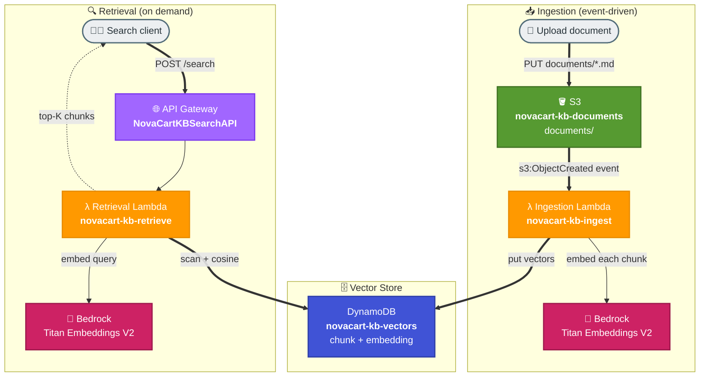

# Task 2: Document Ingestion & Retrieval Workflow

## Goal
Build an automated, event-driven document ingestion and retrieval pipeline on AWS. Documents dropped into S3 are **automatically** extracted, chunked, embedded with Amazon Bedrock, and stored as vectors in DynamoDB. A search API then retrieves the most relevant chunks for any query using semantic similarity.

This is the production backbone that a RAG assistant (Task 1) sits on top of: Task 1 was a local script with in-memory vectors; Task 2 is a real serverless service where ingestion happens automatically on upload and retrieval is exposed over HTTP.

## Real-World Use Case
A growing knowledge base for NovaCart support. The support team simply uploads new or updated help-center documents to an S3 folder. Within seconds the content is searchable through a semantic retrieval API — no manual re-indexing, no servers to manage.

## Architecture


## Why DynamoDB as the Vector Store
A managed vector database (OpenSearch Serverless, Aurora pgvector) is ideal at large scale, but for this workflow a serverless DynamoDB table is used: it needs no provisioning, stores each chunk's embedding as a JSON string, and the retrieval Lambda computes cosine similarity in pure Python. This keeps the example fully serverless and free of cluster management.

## Resources Created
| Service | Resource | Purpose |
|---|---|---|
| S3 | novacart-kb-documents-353211646521 | Document drop zone (documents/ prefix) |
| DynamoDB | novacart-kb-vectors | Stores chunks + embeddings (PK: chunkId) |
| Lambda | novacart-kb-ingest | S3-triggered: chunk + embed + store |
| Lambda | novacart-kb-retrieve | API-triggered: embed query + similarity search |
| API Gateway | NovaCartKBSearchAPI | POST /search endpoint (prod stage) |
| IAM Role | novacart-kb-pipeline-role | S3 read, DynamoDB R/W, Bedrock invoke |

## Bedrock Model
| Role | Model |
|---|---|
| Embeddings (documents and queries) | `amazon.titan-embed-text-v2:0` (1024-dim) |

## Search API
**Base URL**
```text
https://tdf4du7z9g.execute-api.ap-south-1.amazonaws.com/prod
```
**POST /search**
```json
{ "query": "How long do refunds take?", "topK": 3 }
```
Returns the top-K chunks with their source document and cosine score.

## How It Works
### Ingestion (automatic)
1. A document is uploaded to `s3://novacart-kb-documents-.../documents/`.
2. S3 emits an `ObjectCreated` event that invokes the ingestion Lambda.
3. The Lambda reads the file, normalises line endings, and splits it into ~700-character overlapping chunks.
4. Each chunk is embedded with Titan and written to DynamoDB with its source and text.

### Retrieval (on demand)
1. A client calls `POST /search` with a query.
2. The retrieval Lambda embeds the query with Titan.
3. It scans the vector table and computes cosine similarity for every chunk in pure Python.
4. It returns the top-K most similar chunks, each with its source and score.

## How to Run / Demo

### Upload documents (triggers ingestion)
```bash
aws s3 cp my-doc.md \
  s3://novacart-kb-documents-353211646521/documents/my-doc.md \
  --no-verify-ssl
```

### Search
```bash
curl -s -X POST https://tdf4du7z9g.execute-api.ap-south-1.amazonaws.com/prod/search \
  -H "Content-Type: application/json" \
  -d '{"query":"How long do refunds take to reach my account?","topK":3}'
```

## Verified Results
After uploading the 5 NovaCart help-center docs (16 chunks total):

| Query | Top Source | Score |
|---|---|---|
| "How long do refunds take to reach my account?" | returns-refunds.md | 0.33 |
| "Can I cancel my order after it ships?" | orders-tracking.md | 0.40 |
| "Do gift cards expire?" (new doc) | gift-cards.md | 0.33 |

The gift-cards document was uploaded **after** the others and became searchable within seconds — proving the ingestion is fully automatic and incremental.

## Files
| File | Purpose |
|---|---|
| lambda/ingest_handler.py | S3-triggered ingestion Lambda |
| lambda/retrieve_handler.py | API-triggered retrieval Lambda |
| iam/trust-policy.json | Lambda assume-role trust policy |
| iam/pipeline-policy.json | S3 + DynamoDB + Bedrock permissions |
| s3-notification.json | S3 event notification configuration |
| setup_search_api.py | Wires API Gateway to the retrieval Lambda |

## Key Takeaways
- Event-driven ingestion (S3 → Lambda) removes manual indexing entirely.
- Embeddings turn documents and queries into comparable vectors for semantic search.
- DynamoDB plus in-Lambda cosine similarity is a simple, fully serverless vector store for small to medium corpora.
- The same pattern upgrades to OpenSearch or a Bedrock Knowledge Base for large-scale retrieval.
