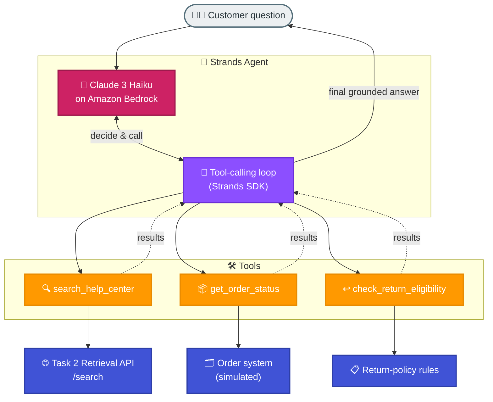

# Task 3: Tool-Calling with the Strands Agents SDK

## Goal
Build an AI agent that uses **tool-calling** (function calling) with the open-source [Strands Agents SDK](https://strandsagents.com) running on Amazon Bedrock. The agent is given a set of tools and the model decides, per question, which tool(s) to invoke — instead of answering from memory.

## Real-World Example
A **NovaCart AI customer-support agent**. It is the natural "agent" layer on top of the services built earlier in Week 3: it can look up orders, apply return-policy rules, and search the help-center — and it answers questions that require combining several of these.

The help-center search tool calls the **real document-retrieval API from Task 2**, so this is genuine cross-task integration, not a mock.

## Architecture


## What is Tool-Calling?
The LLM does not run code itself. Instead:
1. The agent sends the question plus the tool definitions to the model.
2. The model replies "call tool X with these arguments".
3. The Strands SDK runs the matching Python function and returns the result to the model.
4. The model either calls another tool or produces the final answer.

The `@tool` decorator turns a normal Python function into a tool — its name, docstring, and type hints become the schema the model sees.

## The Tools
| Tool | What it does | Backing system |
|------|--------------|----------------|
| `search_help_center(query)` | Semantic search of NovaCart policies | **Real** — calls the Task 2 retrieval API |
| `get_order_status(order_id)` | Returns order status and details | Simulated order system (in-code) |
| `check_return_eligibility(category, days)` | Applies the 7-day / non-returnable rules | Business logic |

## Models & SDK
| Component | Value |
|-----------|-------|
| Agent SDK | `strands-agents` (Strands Agents) |
| Model | `anthropic.claude-3-haiku-20240307-v1:0` on Bedrock |
| Region | ap-south-1 |

## How to Run
```bash
cd week3/task3-tool-calling
pip install -r requirements.txt

# one-shot
python support_agent.py "What is the status of order ORD-1001?"

# interactive
python support_agent.py
```

## Verified Tool-Calling Scenarios

**1. Single tool — order lookup**
> Q: "What is the status of order ORD-1001?"
> → Agent calls `get_order_status` → "Wireless Headphones, Out for Delivery, INR 2499."

**2. Real API integration — help-center search**
> Q: "How long do refunds take to reach my bank account?"
> → Agent calls `search_help_center` (→ Task 2 API) → "UPI 1–2 days, cards 3–5 days, initiated within 24h of inspection."

**3. Multi-tool chaining — order + policy**
> Q: "I want to return my order ORD-1003. Is it eligible?"
> → Agent calls `get_order_status` (earphones, delivered 10 days ago) **then** `check_return_eligibility` → "Not eligible: earphones are non-returnable and it is past the 7-day window."

In every case the console shows the `Tool #N:` lines confirming which tools the model chose to call.

## Sample Orders (simulated)
| Order | Item | Category | Status |
|-------|------|----------|--------|
| ORD-1001 | Wireless Headphones | electronics | Out for Delivery |
| ORD-1002 | Cotton T-Shirt | fashion | Delivered (3 days) |
| ORD-1003 | Bluetooth Earphones | earphones | Delivered (10 days) |

## Files
| File | Purpose |
|------|---------|
| support_agent.py | The Strands agent and its three tools |
| requirements.txt | Strands SDK + boto3 + requests |

## Notes
- A small boto3 patch forces `verify=False` on all clients so Bedrock works through the corporate TLS proxy.
- The same agent pattern extends to more tools (start an order via the Task 5 API, issue refunds, create tickets) without changing the core loop.

## Key Takeaways
- Tool-calling lets an LLM take actions and fetch live data instead of guessing.
- With Strands, a tool is just a decorated Python function — its docstring and type hints define the schema.
- The model orchestrates multiple tools automatically to answer compound questions.
- Grounding tools (like the Task 2 search API) keep answers accurate and current.
