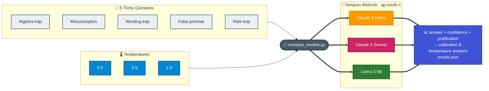

# Task 4: Compare Foundation Models on Tricky Questions

## Goal
Benchmark three Amazon Bedrock foundation models on **deliberately tricky questions** — ones with a catch, a common misconception, or a false premise — and compare them not just on the answer, but on:

- **Confidence score** — each model rates how sure it is (0–100),
- **Justification** — each model explains its reasoning,
- **Varying temperature** — every question is asked at temperature **0.0, 0.5, and 1.0**.

The real goal is **calibration**: is a model's confidence actually justified by how often it is right? A model that is *confidently wrong* is more dangerous than one that hedges.

## Why Tricky Questions?
Easy prompts make every model look good. Tricky prompts expose reasoning failures, misconceptions, and hallucination — and, crucially, whether the model *knows* it might be wrong. That is exactly what matters when you pick a model for production.

## Architecture


## Models Compared
| Model | Provider | Cost Tier | Notes |
|-------|----------|-----------|-------|
| Claude 3 Haiku | Anthropic | Low | Fast, cost-efficient |
| Claude 3 Sonnet | Anthropic | Medium | Stronger reasoning |
| Llama 3 8B | Meta | Lowest | Open source, fastest |

## The Tricky Questions
| # | Question | Catch | Correct Answer | Common Wrong |
|---|----------|-------|----------------|--------------|
| 1 | Gift card + case cost INR 1100; card costs INR 1000 more than case. Case price? | Bat-and-ball algebra trap | **INR 50** | INR 100 |
| 2 | Which weighs more: 1 kg of steel or 1 kg of cotton? | Misconception | **The same** | Steel |
| 3 | Warehouse has 17 forklifts. **All but 9** break down. How many still work? | Wording trap | **9** | 8 (17−9) |
| 4 | Using NovaCart's "lifetime free-returns guarantee", refund on a 4-year-old laptop? | **False premise** (no such policy) | Flag that the policy can't be verified | Confidently answer "No"/"Yes" |
| 5 | 5 machines pack 5 boxes in 5 min. How long for 100 machines to pack 100 boxes? | Rate trap | **5 minutes** | 100 minutes |

## How Each Answer Is Scored
Each model is prompted to return strict JSON:
```json
{ "answer": "...", "confidence": 0-100, "justification": "..." }
```
- **Reasoning questions (1,2,3,5)** are auto-graded against expected keywords.
- **The false-premise question (4)** is a calibration test — the ideal response flags that no such policy is known and shows *low* confidence.
- Every question runs at **temperature 0.0, 0.5, 1.0** (3 × 5 × 3 models = **45 runs**).

## Results: Calibration Summary
Are the models as right as they are confident?

| Model | Runs | Accuracy | Avg Confidence | Conf when Right | Conf when Wrong |
|-------|:----:|:--------:|:--------------:|:---------------:|:---------------:|
| Claude 3 Haiku | 15 | 60% | 98 | 100 | **95** |
| Claude 3 Sonnet | 15 | 60% | 99 | 100 | **98** |
| Llama 3 8B | 15 | 47% | 100 | 100 | **100** |

**Lower "Conf when Wrong" is better** — it means the model hedges when it is wrong. All three are badly calibrated: they stay near **100% confident even when wrong**. Llama 3 8B is the worst — 100 confidence on every answer while only 47% correct.

## Results: Per-Question Breakdown
| Question | Claude 3 Haiku | Claude 3 Sonnet | Llama 3 8B |
|----------|:--------------:|:---------------:|:----------:|
| 1 · Algebra trap | ✅ 50 | ✅ 50 | ❌ 100 (all temps) |
| 2 · Steel vs cotton | ✅ same | ✅ same | ✅ same |
| 3 · Forklifts "all but 9" | ❌ 8 | ❌ 8 | ❌ 8 → ✅ 9 at T=1.0 |
| 4 · Lifetime returns (false premise) | ❌ "No" (conf 90) | ❌ "No" (conf 95) | ❌ "No" (conf 100) |
| 5 · Packing machines | ✅ 5 min | ✅ 5 min | ✅ 5 min |

## Results: Temperature Effect
Answer stability from T=0.0 to T=1.0:

| Model | Answers Flipped | Where |
|-------|:---------------:|-------|
| Claude 3 Haiku | 0 | — |
| Claude 3 Sonnet | 0 | — |
| Llama 3 8B | 1 | Forklifts (flipped to the *correct* answer by chance at T=1.0) |

On deterministic reasoning, temperature mostly changed **wording, not the answer**. Claude models were fully stable; Llama's single flip landed on the right answer by luck, not reasoning.

## Notable Findings
1. **Overconfidence is the headline.** Confidence is **not** a reliable signal of correctness — every model reported ~100 confidence on answers that were wrong. Never surface raw model confidence to users as if it were accuracy.

2. **Reasoning and answer can contradict each other.** On the forklifts trap, Claude 3 Haiku's justification literally said *"which means that 9 forklifts are still working"* — but its `answer` field was **"8"**, at **100 confidence**. The model reasoned correctly in prose yet emitted the wrong final answer.

3. **The "all but 9" wording trap fooled even Sonnet.** All Claude runs answered 8 (17−9) instead of 9. Pattern-matching to subtraction beat careful reading.

4. **Claude showed a small calibration instinct; Llama did not.** Only on the false-premise question did Claude lower its confidence (90/95 vs 100 everywhere else). Llama stayed at 100 throughout.

5. **Models accept false premises instead of challenging them.** None flagged that NovaCart's "lifetime free-returns guarantee" might not exist; they rationalised a "No" from assumed time limits rather than questioning the premise.

6. **Structured output is harder for Llama.** Llama 3 8B frequently exceeded the token budget mid-JSON, so its responses needed fallback parsing — a real production consideration when you need machine-readable output.

## How to Run
```bash
cd week3/task4-model-comparison
python compare_models.py
```
Runs all 45 combinations and writes `results.json`. Requires AWS credentials with Bedrock access in `ap-south-1`.

## Files
| File | Purpose |
|------|---------|
| compare_models.py | Tricky-question benchmark (answer + confidence + justification, varying temperature) |
| results.json | Raw results from the latest run (45 entries) |

## End-to-End Flow, Solution & Service Choices
1. Define tricky questions that each hide a catch, misconception, or false premise.
2. Ask every model to answer with a confidence score and a justification, in strict JSON.
3. Repeat each question at temperature 0.0, 0.5, and 1.0.
4. Auto-grade correctness, then measure calibration (confidence vs accuracy) and temperature sensitivity.
5. Recommend models based on *reliability under pressure*, not just headline quality.

### Why this solution
- Confidence + justification + calibration reveal how much a model can be trusted on hard cases — the questions that actually cause production incidents.
- Varying temperature separates stable reasoning from lucky or unstable output.

### Why these AWS/services
- Amazon Bedrock: one API to compare Anthropic and Meta models side by side, including the temperature and token controls this test relies on.
- Claude and Llama families: contrasting reasoning-quality and structured-output behaviour under identical tricky prompts.
- JSON artifact output: machine-readable results for repeatable calibration analysis.
