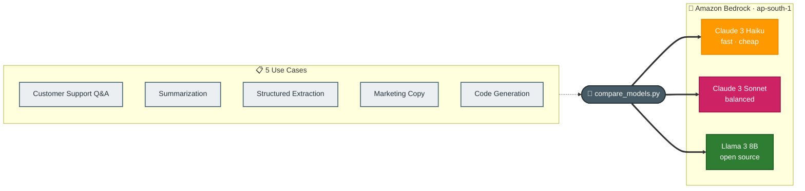

# Task 4: Compare Foundation Models for Different Use Cases

## Goal
Systematically benchmark three Amazon Bedrock foundation models across five real-world use cases (all NovaCart-themed) and compare them on quality, latency, and cost. The output is a recommendation matrix for choosing the right model per task.

## Architecture


## Models Compared
| Model | Provider | Size | Strengths | Cost Tier |
|-------|----------|------|-----------|-----------|
| Claude 3 Haiku | Anthropic | Small | Fast, cost-efficient, good quality | Low |
| Claude 3 Sonnet | Anthropic | Medium | Higher reasoning, structured output | Medium |
| Llama 3 8B | Meta | 8B params | Open source, fastest, cheapest | Lowest |

## Use Cases (all NovaCart-themed)
| # | Use Case | What It Tests |
|---|----------|---------------|
| 1 | Customer Support Q&A | Short factual answer, friendly tone |
| 2 | Summarization | Condense a customer complaint into bullet points |
| 3 | Structured Extraction | Extract JSON fields from a customer email |
| 4 | Marketing Copy | Write a 20-word push notification |
| 5 | Code Generation | Write a Python function with docstring and type hints |

## Results: Latency & Cost

| Use Case | Model | Latency (s) | Output Tokens | Est. Cost (USD) |
|----------|-------|:-----------:|:-------------:|:---------------:|
| Customer Support Q&A | Claude 3 Haiku | 0.89 | 69 | $0.000099 |
| Customer Support Q&A | Claude 3 Sonnet | 0.93 | 40 | $0.000756 |
| Customer Support Q&A | **Llama 3 8B** | **0.52** | 50 | **$0.000045** |
| Summarization | Claude 3 Haiku | 0.96 | 100 | $0.000158 |
| Summarization | Claude 3 Sonnet | 1.94 | 107 | $0.002004 |
| Summarization | **Llama 3 8B** | **0.86** | 91 | **$0.000091** |
| Structured Extraction | **Claude 3 Haiku** | **0.71** | 83 | $0.000134 |
| Structured Extraction | Claude 3 Sonnet | 0.98 | 79 | $0.001551 |
| Structured Extraction | Llama 3 8B | 1.04 | 115 | **$0.000101** |
| Marketing Copy | Claude 3 Haiku | 0.48 | 32 | $0.000051 |
| Marketing Copy | Claude 3 Sonnet | 0.83 | 34 | $0.000639 |
| Marketing Copy | **Llama 3 8B** | **0.32** | 25 | **$0.000028** |
| Code Generation | **Claude 3 Haiku** | **2.12** | 300 | $0.000403 |
| Code Generation | Claude 3 Sonnet | 3.25 | 300 | $0.004830 |
| Code Generation | Llama 3 8B | 2.53 | 300 | **$0.000208** |

## Results: Quality Assessment

| Use Case | Claude 3 Haiku | Claude 3 Sonnet | Llama 3 8B |
|----------|:--------------:|:---------------:|:----------:|
| Customer Support Q&A | Good — friendly but generic | **Best** — concise, specific timeline | Good — apologetic, escalation |
| Summarization | **Best** — clean bullet points | Good — detailed but longer | Good — captures key points |
| Structured Extraction | **Best** — clean JSON, correct fields | **Best** — clean JSON, precise | Fair — wrapped in markdown code block |
| Marketing Copy | **Best** — punchy, within limit | Good — used emoji (encoding issue) | Good — ALL CAPS style |
| Code Generation | **Best** — correct, typed, docstring | Good — correct, typed | Good — correct but less polished |

## Recommendation Matrix

| Use Case | Best Model | Why |
|----------|-----------|-----|
| Customer Support Q&A | **Llama 3 8B** | Fastest (0.52s) and cheapest; quality is sufficient for short factual answers |
| Summarization | **Claude 3 Haiku** | Best quality bullet points at low cost; 2x faster than Sonnet |
| Structured Extraction | **Claude 3 Haiku** | Cleanest JSON output; Sonnet is 10x costlier for similar quality |
| Marketing Copy | **Llama 3 8B** | Fastest and cheapest; creative quality is comparable |
| Code Generation | **Claude 3 Haiku** | Best code quality (docstrings, types); fastest at 2.12s |
| Complex reasoning | Claude 3 Sonnet | Higher-quality reasoning for ambiguous or nuanced tasks |

## Key Findings

1. **Llama 3 8B is the latency and cost winner** — consistently fastest (0.3–2.5s) and 3–10x cheaper than Claude models. For high-volume, latency-sensitive tasks (chatbot, classification), it is the best choice.

2. **Claude 3 Haiku is the quality/cost sweet spot** — nearly as fast as Llama, but produces better structured output (clean JSON, proper code, concise summaries). Best default for most production use cases.

3. **Claude 3 Sonnet is the quality leader but 10–12x more expensive** — use it only where reasoning quality matters enough to justify the cost (e.g., complex multi-step analysis, ambiguous edge cases).

4. **Cost differences are dramatic at scale**: processing 1 million support questions would cost ~$45 with Llama 3 8B, ~$99 with Claude 3 Haiku, or ~$756 with Claude 3 Sonnet.

## How to Run
```bash
cd week3/task4-model-comparison
python compare_models.py
```
Results are saved to `results.json`.

## Files
| File | Purpose |
|------|---------|
| compare_models.py | Benchmark script (invoke, measure, compare) |
| results.json | Raw results from the latest run |
